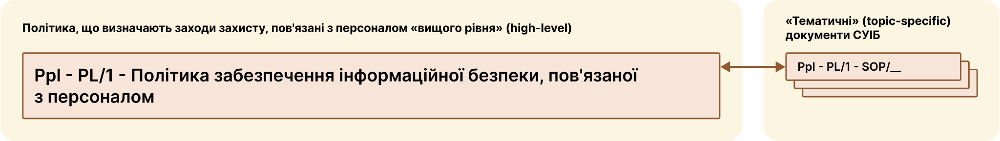

# Заходи забезпечення інформаційної безпеки, пов’язаної з персоналом

Заходи забезпечення інформаційної безпеки, пов’язаної з персоналом  реалізуються шляхом імплементації [Політики забезпечення інформаційної безпеки, пов'язаної з персоналом](/hr#політика-забезпечення-інформаціиноі-безпеки-пов-язаноі-з-персоналом), яка є документом СУІБ «вищого рівня», і яка доповнюється відповідними «тематичними» документами СУІБ  

## Політика забезпечення інформаційної безпеки, пов'язаної з персоналом
Тут будуть посилання на документи