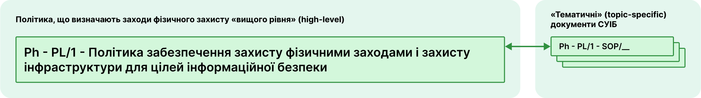

# Заходи забезпечення інформаційної безпеки фізичними заходами захисту

Заходи забезпечення інформаційної безпеки фізичними заходами захисту реалізуються шляхом імплементації [Політики забезпечення захисту фізичними заходами і захисту інфраструктури для цілей інформаційної безпеки](/physical#політика-забезпечення-захисту-фізичними-заходами-і-захисту-інфраструктури-для-цілеи-інформаціиноі-безпеки), яка є документом СУІБ «вищого рівня», і яка доповнюється відповідними «тематичними» документами СУІБ.  

## Політика забезпечення захисту фізичними заходами і захисту інфраструктури для цілей інформаційної безпеки
Тут будуть посилання на документи