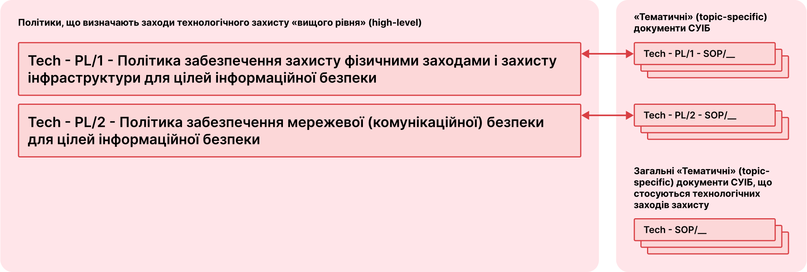

# Технологічні заходи забезпечення інформаційної безпеки

Технологічні заходи забезпечення інформаційної безпеки реалізуються шляхом імплементації політик «вищого» рівня:

* [Політика забезпечення захисту фізичними заходами і захисту інфраструктури для цілей інформаційної безпеки](/tech#політика-забезпечення-захисту-фізичними-заходами-і-захисту-інфраструктури-для-цілеи-інформаціиноі-безпеки);
* [Політика забезпечення мережевої (комунікаційної) безпеки для цілей інформаційної безпеки](/tech#політика-забезпечення-мережевоі-комунікаціиноі-безпеки-для-цілеи-інформаціиноі-безпеки);

Кожна із вказаних політик доповнюється відповідними «тематичними» документами СУІБ в частині, що стосується.
Крім зазначених Політик «вищого» рівня і «тематичних» документів СУІБ, що їх доповнюють, технологічні заходи забезпечення інформаційної безпеки імплементуються [загальними «тематичними» документами СУІБ](/tech#загальні-«тематичні»-документи-суіб).  

## Політика забезпечення захисту фізичними заходами і захисту інфраструктури для цілей інформаційної безпеки
Тут будуть посилання на документи

## Політика забезпечення мережевої (комунікаційної) безпеки для цілей інформаційної безпеки
Тут будуть посилання на документи

## Загальні «тематичні» документи СУІБ
Тут будуть посилання на документи